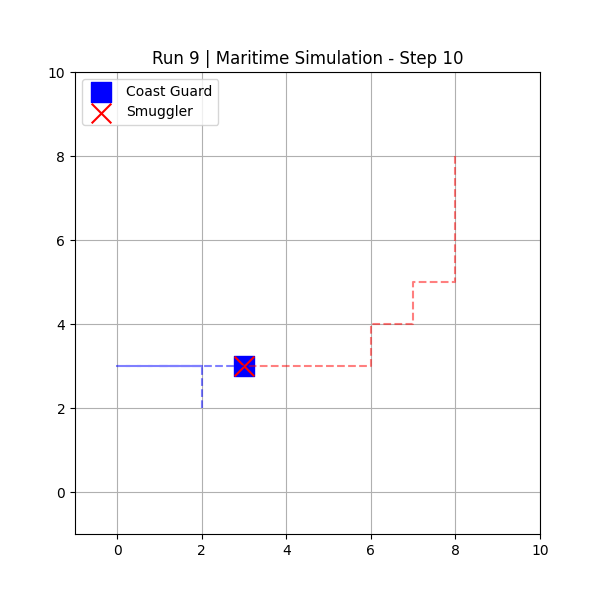
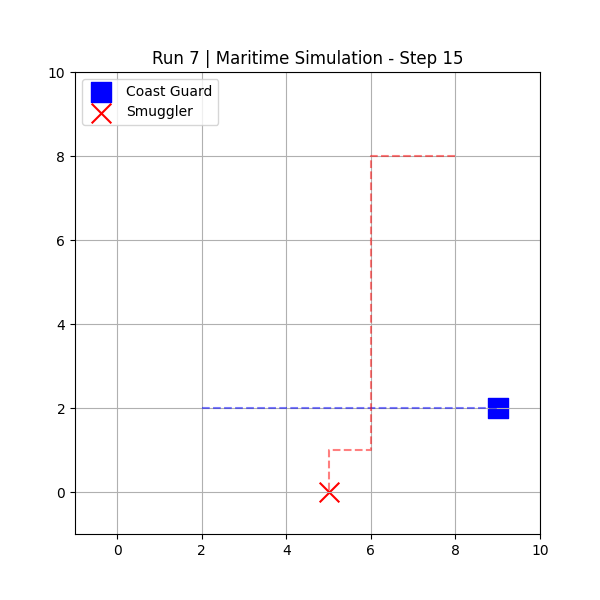
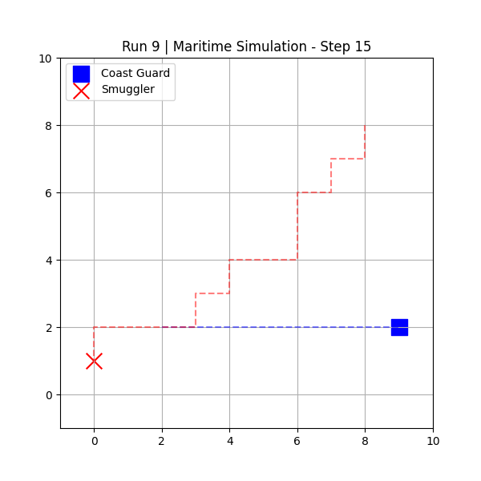

# 🌊 Autonomous Maritime Agents: LLM-Driven Spatial Decision Making

**Author:** Chiara de Groot  
**Context:** A lightweight 2D testbed for AI Red Teaming & Adversarial Analysis.  

---

## 🎯 Project Overview
This project explores the integration of Generative AI (LLMs) as the decision-making "brain" for agents in a spatial simulation. Specifically, it simulates a (maritime) pursuit scenario (Coast Guard vs. Smuggler) to evaluate the spatial reasoning capabilities, limitations, and failure modes of instruct-tuned LLMs in this kind of environment.

### **Key Questions:**
* Can a text-based LLM successfully navigate a 2D spatial grid to intercept a moving target?
* What are the primary failure modes when the agent's environment changes dynamically?
* How do zero-shot LLMs behave when dynamic targets invalidate their established spatial reasoning patterns?

---

## 🛠️ Tech Stack
* **Language:** Python 3.11.14
* **Simulation Environment:** Custom 2D Grid via `matplotlib`
* **Agent Logic (LLM):** `mistral:7b-instruct` (Running locally via Ollama)
* **API Integration:** OpenAI Python Client (Redirected to localhost)

---

## 🚀 Installation & Setup

**1. Clone the repository**
```bash
git clone https://github.com/chiaradg01/maritime_llm_sim.git
cd maritime_llm_sim
```

**2. Install dependencies**
```bash
pip install matplotlib python-dotenv openai
```

**3. Start LLM server**
Ensure Ollama is installed and running in the background.
```bash
ollama run mistral:7b-instruct
```
**4. Run simulations**
```bash
python sim_v1_baseline.py
python sim_v2_tweaked.py
```
---

## 📊 V1 Baseline Results & Failure Analysis

To establish a quantitative baseline, the `mistral:7b-instruct` model was subjected to a 10-run automated adversarial test (`sim_v1_baseline.py`). The agent was tasked with intercepting a moving target within a 10x10 coordinate grid over 15 turns.

**System prompt V1**
```text
"""You are a highly logical Coast Guard captain.
Your goal is to intercept the smuggler vessel.
Grid rules: North increases y, South decreases y, East increases x, West decreases x.
You must output EXACTLY ONE WORD indicating your move: North, South, East, West, or Wait.
Do NOT explain your reasoning. Do NOT output any punctuation."""
```

**Overall Success Rate V1: 10% (1/10 Interceptions)**

A qualitative review of the movement logs (`simulation_logs.txt`) and spatial tracking visualisations reveals three severe failure modes in the LLM's spatial reasoning:

1. **Y-Axis Neglect (Directional Blindness):** In 90% of the runs, the LLM agent successfully identified the need to move West or East, but completely failed to track the Smuggler on the Y-axis. Once the Smuggler passed the Coast Guard's Y-coordinate, the LLM refused to output "South" to pursue, demonstrating an inability to dynamically recalculate relative positioning (e.g., failing to realize that if `Target Y < Agent Y`, the correct move is South).
2. **Horizontal Oscillation (Axis Lock):** Because the model failed to correct its Y-axis, it entered a state of "Axis Lock". In all of the runs, the agent rapidly oscillated horizontally (alternating West and East) while the target escaped, indicating a breakdown in the model's textual logic loop when it lost its geometric bearings.
3. **Passive "Lucky" Interception:** The only successful interception occurred in Run 9. However, the log reveals that the LLM did not actively pursue the target. Instead, the Coast Guard moved around in the bottom-left quadrant (oscillating between X:0 and X:3), and the "randomly" moving Smuggler accidentally collided with it at Turn 10.

<p align="center">
  
  
</p>

**Conclusion for V1:** This baseline testing highlights that while small, zero-shot LLMs might understand the *concept* of interception, they cannot be blindly trusted to handle deterministic spatial routing. Relying on an LLM for autonomous navigation without explicit coordinate-math guardrails is highly unsafe.

---
## 📊 V2 Tweaked Prompt Results & Analysis
To mitigate the spatial blindness observed in V1, the system prompt was tweaked to include specific algorithmic rules and a tie-breaker line.

**System prompt V2**
```text
"""You are a highly logical Coast Guard AI intercepting a smuggler.
Compare your coodinates to the smuggler's coordinates and moves towards them.

CRITICAL ALGORITHMIC RULES:
- If smuggler Y is less than your Y, just must move South.
- If smuggler Y is greater than your Y, you must move North.
- If smuggler X is less than your X, you must move West.
- If smuggler X is greater than your X, you must move East.
- CONFLICT RESOLUTION: If the smuggler is diagonal to you (e.g. both North and East), you must pick EXACTLY ONE direction to move this turn. Do not combine words.
You must output EXACTLY ONE WORD indicating your move: North, South, East, West, or Wait.
Do NOT explain your reasoning. Do NOT output any punctuation."""
```

**Overall Success Rate V2: 0% (0/10 Interceptions)**

* **The Result:** Enforcing strict algorithmic rules seems to have broken the model's reasoning logic. Across all 10 runs, and each turn of those, the LLM outputted the same one word: "East".
* **Autoregressive Collapse (Severe Inertia Bias):** The logs reveal a complete systematic collapse. Even after the Coast Guard bypassed the smuggler on the X-axis, the LLM continued to output "East". It entirely ignored the prompt's logical constraints and dynamic coordinate updates.

<p align="center">
  
  
</p>

**Conclusion for V2:** Forcing a smaller language model like `mistral-7b-instruct` to act as a strict logic gate caused it to fall into an (autoregressive) repetition loop. Prompt-based rigid algorithms introduce severe tunnel vision, suggesting that smaller text-predictors cannot be safely coerced into operating as deterministic state machines.

---

## ⚠️ Scope & Limitations

This project is a simplified prototype meant to test AI decision-making. It is important to keep the following limitations in mind when comparing this to real-world autonomous systems:
* **Zero-Shot Prompting:** The model's decision-making is evaluated entirely in a _zero-shot_ capacity. The system prompts provide strict logical rules but no examples of correct input-output pairs. While this tests the model's inherent spatial reasoning, it is possible that _few-shot_ prompting (providing in-context examples of correct coordinate math) could mitigate the observed autoregressive collapse.
* **Using a Smaller AI Model:** This simulation uses `mistral:7b-instruct`, a relatively small, locally hosted language model. Therefore, it demonstrates the failure modes of small, zero-shot open-source models fail, whereas frontier models like Claude 3.5 Sonnet or GPT-4o might succeed.
* **A Simplified World:** The 10x10 grid is a basic environment. It does not account for real-world physical factors that would be present if this were a real situation,  like a boat's turning speed, ocean currents, or sensor errors. 
* **Turn-Based vs. Real-Time:** This simulation happens in predictable turns where the AI perfectly knows the target's location. In a real scenario, decisions must be made instantly, often with incomplete or delayed information.

#### **Core Takeaway:** Even though this is a highly simplified testbed, this project demonstrates that _small_, zero-shot LLMs cannot be blindly trusted to navigate physical spaces on their own. They require strict, hard-coded safety algorithms to function reliably.
---

## 🚀 Future Work
* **Automated Batch Testing:** Implement a script to run 100+ iterations to calculate statistically significant interception rates.
* **Hybrid Architecture:** The failures in V1 and V2 show that these kinds of  small models cannot handle raw spatial routing. Future iterations should adopt a hybrid approach, utilizing a deterministic pathfinding algorithm (like A* Search) for spatial navigation, while using the LLM purely for high-level tactical strategy (like predicting the ultimate destination of the smuggler).
* **Frontier Model Testing:** Evaluate the simulation using state-of-the-art models to determine if reliable spatial reasoning and coordinate math emerge at scale, or if the autoregressive collapse observed in the current smaller model persists across all LLM architectures.
* **Few-Shot Prompting Interventions:** The current simulation evaluates the model's zero-shot spatial reasoning. Future iterations could test whether the model with few-shot examples mitigates the autoregressive collapse that was observed in V2.